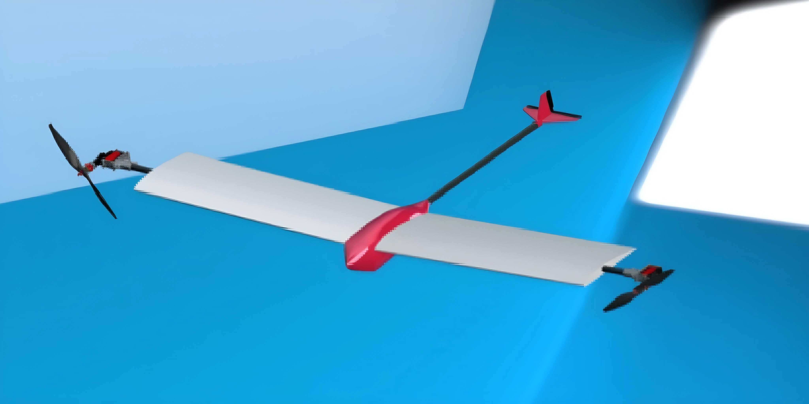
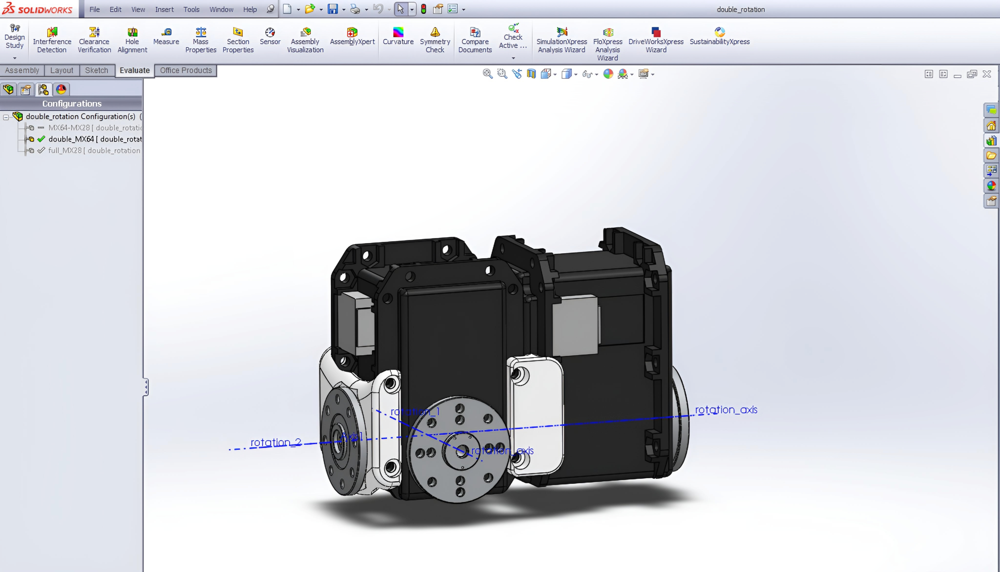
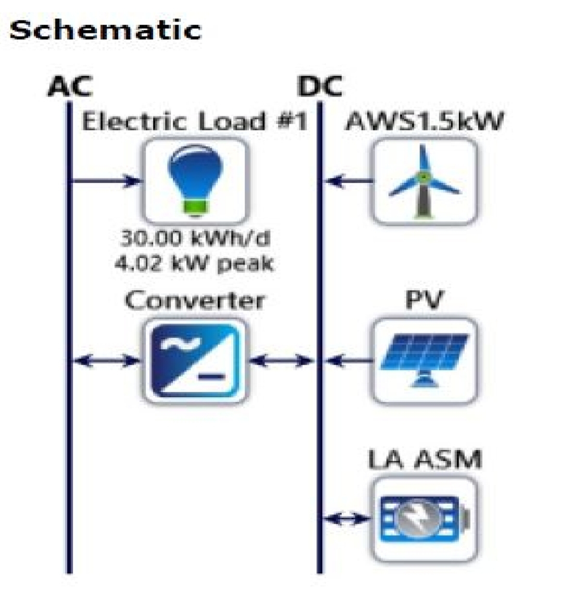
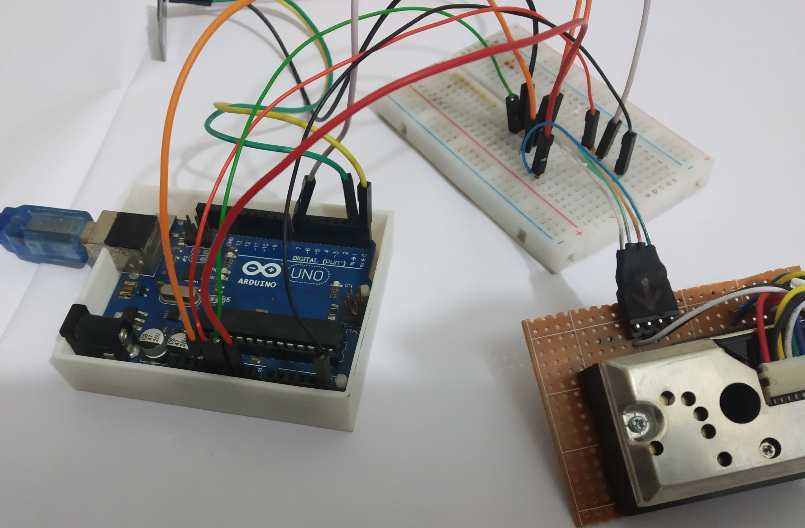
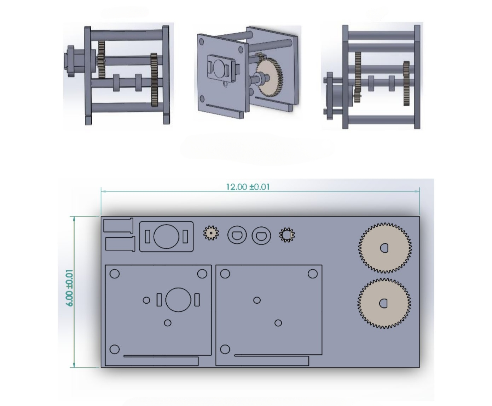

# Hi, I'm Turjo 👋

🎓 Mechanical Engineering Graduate | Passionate about **Robotics, UAVs & CAD Design**  

> Mechanical Engineering graduate building innovative UAVs, robotics, and CAD projects. Skilled in SolidWorks, ANSYS, XFLR5, Arduino, and embedded systems, bridging mechanical design with intelligent control.

---

## 🔹 Skills & Tools  

  
  
  
  
  

---

## 🔹 Highlights
- 🛠 **Hybrid VTOL UAV** – Optimized tilt-rotor thrust vectoring for efficient hover-to-cruise transitions  
- ⚙️ **Stress-Optimized Gearbox** & **Hybrid Dual-Rotation Actuator (MX-64 + MX-64)** for compact robotic applications  
- 🌫️ **Low-Cost Arduino Dust Sensor** – Affordable environmental monitoring  
- 🤖 Hybrid robotics designs integrating multiple Dynamixel servos for precise and compact actuation  
- 📐 CAD optimizations in **SolidWorks** for efficient mechanical assemblies  
- 💡 Hands-on experience with **3D-printed and PLA-carbon fiber hybrid prototypes**  
- 🧮 Engineering simulations in **ANSYS** and **XFLR5** for aerodynamics & stress analysis  
- 📊 Data logging & visualization of sensor and actuator performance metrics  
- 🏗️ Focused on **design for manufacturability, assembly, safety, and durability**  

---

# 🚀 Featured Projects

## 1️⃣ Fixed-Wing VTOL UAV ✈️

Completed the design and development of a **fixed-wing VTOL UAV**, including **aerodynamic analysis, CAD modeling, subsystem integration, fabrication, and control system implementation**. Presented as a thesis poster and led to a **conference paper at IEEE ECCE 2025**, highlighting novel VTOL transition strategies.

- 📄 [Thesis Report](docs/vtol_uav/final_thesis_report.pdf)
- 📄 [Presentation Poster](docs/vtol_uav/poster.pdf)
- 💻 [Flight Controller Code](code/vtol_uav/code.ino.txt)
- 🖼 [More Images](images/vtol_uav_gallery/)

**🛠 Skills:** SOLIDWORKS, ANSYS, XFLR5, MATLAB, 3D Modeling, Aerodynamics, Flight Control, Research, Project Management, Presentation Skills  

---

## 2️⃣ Hybrid Dual-Rotation Actuator 🤖

Conceptual design of a **dual-axis actuator** integrating two Dynamixel MX-64 servos in a **four-bearing framework**. Achieves **smooth, precise motion** with enhanced load stability. Modular 3D-printed components reduce weight and optimize manufacturability.

- 💻 [scorpionx](images/scorpionx.jpg)
- 💻 [2D Drawing](images/2d_drawing.png)
- 🖼 [CAD Files & Renders](files/actuator_cad/)

**🛠 Skills:** SOLIDWORKS, CAD Modeling, Robotics, Actuators, Mechatronics, 3D Design, Product Development, Research  

---

## 3️⃣ Hybrid Solar-Wind Power Plant 🌞🌬️

Designed a **hybrid renewable energy system** integrating **solar PV and wind energy** using HOMER software. Optimized **system sizing, energy yield, and cost efficiency** using wind and solar atlas data.

- 📄 [System Design Report](docs/hybrid_pp.pdf)
- 🖼 [Charts & Visuals](images/hybrid_power_plant_gallery/)

**🛠 Skills:** HOMER, Renewable Energy, Solar PV, Wind Turbine Design, Project Management, Research, Power Plant Design, Data Analysis  

---

## 4️⃣ Smart Air Quality Monitoring System 🌫️

Developed an **Arduino-based dust sensor** to measure **particulate matter (PM)** in real-time. Prototype system showcased **low-cost environmental monitoring** with data logging and visualization.

- 📄 [Poster Presentation](docs/dust_sensor_poster.pdf)
- 💻 [Arduino Code](code/dust_code.txt)
- ⚡ [Circuit Image](images/dust_sensor_gallery/circuit.jpg)
- 📉 [Result](images/dust_sensor_gallery/results.jpg)

**🛠 Skills:** Arduino, Embedded Systems, Data Logging, Sensor Integration, MATLAB, Project Management, Research, Presentation Skills  

---

## 5️⃣ Stress-Optimized Compound Gearbox ⚙️

Conceptually designed a **four-gear compound gearbox** in SolidWorks for lifting a **1 kg mass up a 50 cm, 45° ramp**. Conducted **static stress analysis** to optimize material usage and ensure structural integrity.

- 📄 [Design Report](docs/compound_gearbox.pdf)
- ⚙️ [2D Drawing](images/compound_gearbox_gallery/2D/2d_drawings.jpg)
- 🧰 [More 2D Drawings](images/compound_gearbox_gallery/2D/)
- 💻 [CAD Files](files/cad/compound_gearbox/Gearbox.Design.SLDASM)
- 🖼 [Stress Analysis Results](images/compound_gearbox_gallery/results/)

**🛠 Skills:** SOLIDWORKS, CAD, Mechanical Design, Stress Analysis, Power Transmission, Research, Project Management  

---

## 📊 GitHub Activity

  

  
  

  

---

## 📫 Contact  

- 💼 [LinkedIn](https://www.linkedin.com/in/md-laisur-rahman-khan-turjo)  
- 📧 turjokhan2002@gmail.com
