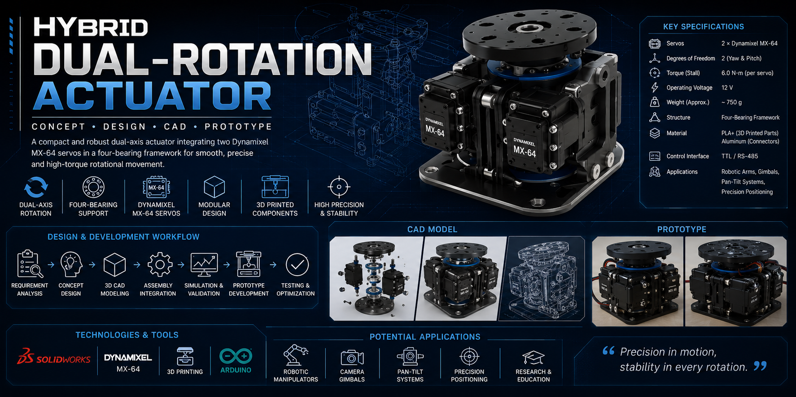
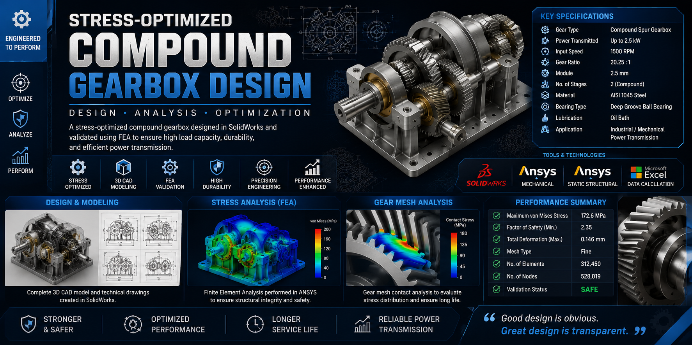
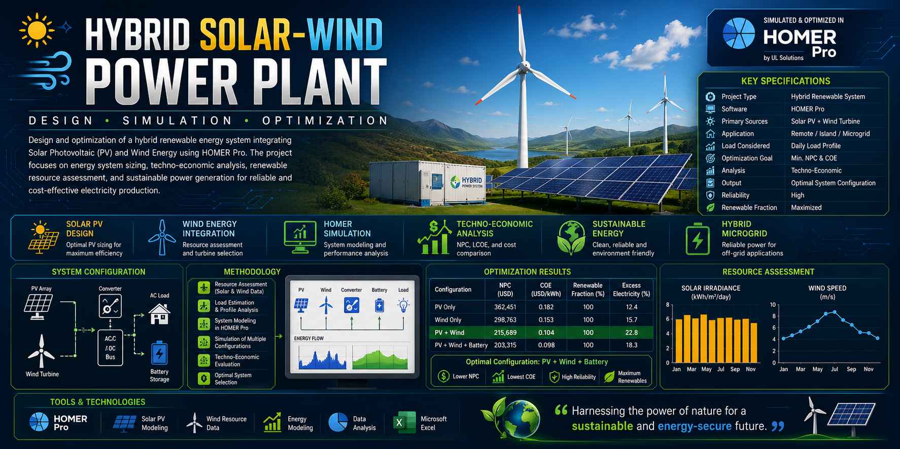
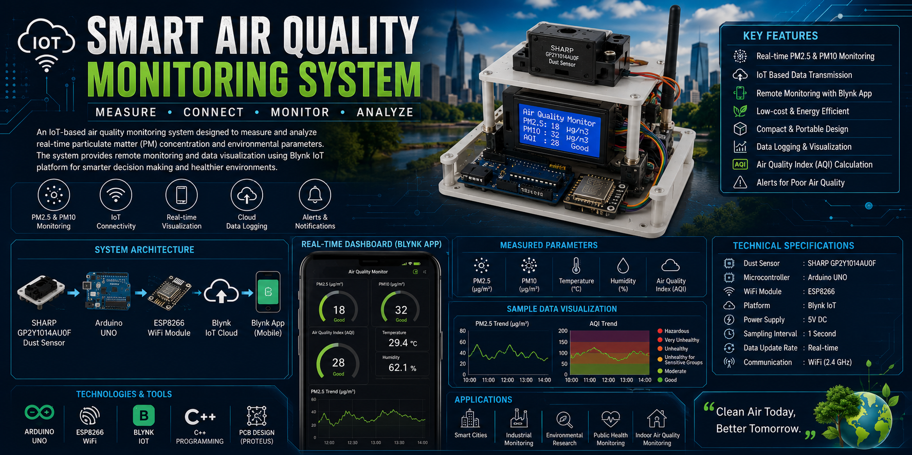
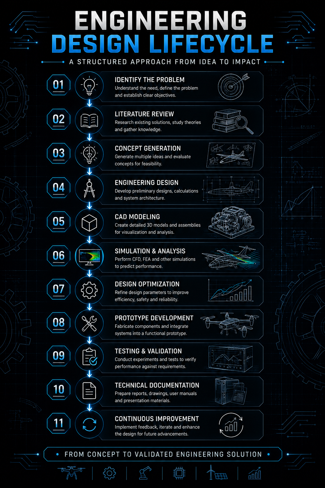

<!-- ========================================================= -->
<!--              Md Laisur Rahman Khan Turjo                  -->
<!-- ========================================================= -->

  

<h1 align="center">
Md Laisur Rahman Khan Turjo
</h1>

<h3 align="center">
Mechanical Engineer • UAV Systems • Robotics • CAD & Simulation • Embedded Systems
</h3>

---

---

# 👋 About Me

I'm a **Mechanical Engineering graduate** from **Ahsanullah University of Science and Technology (AUST)** with a passion for transforming engineering concepts into practical and intelligent solutions.

My work combines **mechanical design, UAV systems, robotics, embedded systems, CAD modeling, engineering simulation, and product development**. From concept generation to simulation, prototyping, testing, and documentation, I enjoy working across the complete engineering development lifecycle.

My flagship project is the **Design and Development of a Fixed-Wing VTOL UAV**, which led to an **IEEE conference publication**. Alongside aerospace projects, I have developed robotic mechanisms, renewable energy systems, and embedded IoT applications while continuously expanding my expertise in multidisciplinary engineering.

---

# 🚀 Engineering Domains

<table>

<tr>

<td width="50%">

### ✈️ Aerospace Engineering

- Fixed-Wing VTOL UAV
- Flight Control Systems
- Aerodynamics
- Airfoil Analysis
- Aircraft Design

</td>

<td width="50%">

### 🤖 Robotics & Mechatronics

- Robot Mechanisms
- Motion Systems
- Servo Integration
- Embedded Control
- Product Development

</td>

</tr>

<tr>

<td>

### ⚙️ Mechanical Design

- CAD Modeling
- Machine Design
- Mechanical Assemblies
- Design Optimization
- Engineering Drawings

</td>

<td>

### 💻 Embedded Systems

- Arduino
- STM32
- ESP8266
- Sensors
- Control Systems

</td>

</tr>

</table>

---

# 🛠 Engineering Toolbox

---
# ⚡ Featured Technologies

## 📌 Core Competencies

| Engineering | Software | Research |
|-------------|----------|----------|
| CAD Design | SolidWorks | IEEE Publication |
| UAV Systems | ANSYS Fluent | Technical Writing |
| Robotics | MATLAB | Engineering Documentation |
| Embedded Systems | XFLR5 | Simulation |
| Product Development | Arduino | Problem Solving |

---
<!-- ========================================================= -->
<!--             RESEARCH PUBLICATION & PROJECTS              -->
<!-- ========================================================= -->

# 📄 Research Publication

My undergraduate research focused on the design and control of a **Fixed-Wing Vertical Take-Off and Landing (VTOL) Unmanned Aerial Vehicle**, integrating aerodynamic analysis, mechanical design, embedded control, and prototype development.

<table>
<tr>
<td>

### 🏆 IEEE Conference Publication

**Control System Design of a Fixed-Wing VTOL UAV**

📍 **2025 IEEE International Conference on Electrical, Computer and Communication Engineering (ECCE)**

📅 **2025**

🔗 **DOI:** `10.1109/ECCE.2025.11013869`

📖 **IEEE Xplore**

https://ieeexplore.ieee.org/document/11013869

</td>
</tr>
</table>

---

# 📈 Portfolio Overview

| Projects | Research | Domains | Status |
|:---------:|:--------:|:-------:|:------:|
| 🚀 5+ Engineering Projects | 📄 IEEE Published | ✈️ Aerospace • 🤖 Robotics • ⚙️ Mechanical | 🟢 Active |

# 🚀 Featured Engineering Projects

Each project represents a complete engineering workflow—from concept development and CAD design to simulation, prototyping, testing, and technical documentation.

---

# ✈️ Fixed-Wing VTOL UAV

### Design and Development of a Fixed-Wing Vertical Take-Off and Landing UAV

My flagship aerospace engineering project focused on designing and developing a **tilt-rotor Fixed-Wing VTOL UAV** capable of seamless transition between vertical take-off and efficient forward flight.

The project involved **aircraft configuration design, aerodynamic optimization, CFD analysis, CAD assembly, structural validation, embedded control integration, prototype development, and IEEE research publication**.

### 🔹 Highlights

- ✈️ Tilt-Rotor Configuration
- 📐 NACA 4412 Airfoil
- 🌬 CFD Analysis
- 📊 Aerodynamic Optimization
- ⚙ Structural Validation
- 💻 Embedded Flight Control
- 🛠 Prototype Development
- 📄 IEEE ECCE 2025 Publication

### 🛠 Technologies

`SolidWorks`
`ANSYS Fluent`
`ANSYS Mechanical`
`XFLR5`
`MATLAB`
`Arduino`

---

# 🤖 Hybrid Dual-Rotation Actuator

### Compact Robotic Actuator using Dual Dynamixel MX-64 Servos

Designed a lightweight robotic actuator integrating **dual Dynamixel MX-64 servo motors** with a four-bearing support mechanism for compact, stable, and precise dual-axis motion.

### 🔹 Highlights

- Dual-Axis Motion
- Four-Bearing Support
- Mechanical Optimization
- CAD Assembly
- 3D Printable Design

### 🛠 Technologies

`SolidWorks`
`Mechanical Design`
`Robotics`
`Mechatronics`

---

# ⚙️ Stress-Optimized Compound Gearbox

### Mechanical Power Transmission Design

Designed a four-stage compound gearbox optimized for efficient torque transmission using CAD modeling and finite element analysis.

### 🔹 Highlights

- Gear Train Design
- Static Structural Analysis
- Mechanical Optimization
- Engineering Drawings

### 🛠 Technologies

`SolidWorks`

`ANSYS Mechanical`

`Machine Design`

---

# 🌞 Hybrid Solar–Wind Power Plant

### Renewable Energy System Design

Designed a hybrid renewable energy system using **HOMER Pro** to optimize the integration of photovoltaic solar panels and wind turbines for reliable and cost-effective power generation.

### 🔹 Highlights

- HOMER Simulation
- Solar PV Design
- Wind Energy Assessment
- Techno-Economic Analysis

### 🛠 Technologies

`HOMER Pro`

`Renewable Energy`

`Energy Analysis`

---

# 🌫 Smart Air Quality Monitoring System

### Arduino-Based Environmental Monitoring Platform

Developed an embedded IoT system capable of monitoring airborne particulate matter in real time using a low-cost optical dust sensor with data acquisition and visualization.

### 🔹 Highlights

- Real-Time PM Monitoring
- Sensor Integration
- Embedded Programming
- Data Logging
- Experimental Validation

### 🛠 Technologies

`Arduino`

`Embedded Systems`

`Sensors`

`MATLAB`

---

# 📂 Complete Engineering Portfolio

Interested in the full engineering process behind these projects?

My portfolio repositories include:

- 📐 Engineering Design Methodology
- 💻 CAD Models & Assemblies
- 🌬 CFD & FEA Simulation
- 📊 Engineering Calculations
- 🛠 Prototype Development
- 🧪 Testing & Validation
- 📄 Technical Documentation
- 📚 Research References
- 🚀 Future Improvements

> Every repository documents not only the final outcome but also the engineering decisions, design iterations, validation process, and lessons learned throughout development.

---
<!-- ========================================================= -->
<!--          ENGINEERING WORKFLOW • GITHUB • CONTACT          -->
<!-- ========================================================= -->

# ⚙️ Engineering Design Lifecycle

  

Every engineering project in this portfolio follows a structured development process that emphasizes analytical design, simulation-driven validation, practical implementation, and continuous improvement.

| Stage | Description |
|--------|-------------|
| 🔍 Requirements | Define objectives, constraints, and performance targets. |
| 💡 Concept Design | Generate and evaluate multiple engineering concepts. |
| 📐 CAD Development | Create detailed 3D models, assemblies, and technical drawings. |
| 📊 Simulation | Validate designs using CFD, FEA, and engineering analysis. |
| ⚡ Optimization | Improve efficiency, manufacturability, weight, and reliability. |
| 🛠 Prototype | Fabricate and integrate mechanical and embedded systems. |
| 🧪 Testing | Verify performance through experiments and validation. |
| 📄 Documentation | Prepare reports, technical drawings, and publications. |

---

# 📊 GitHub Dashboard

This GitHub profile serves as my engineering portfolio, showcasing projects, research, simulations, CAD models, embedded systems, and technical documentation.

---

## 📈 GitHub Statistics

---

## 💻 Most Used Languages

---

## 📅 Contribution Graph

---

## 📊 GitHub Profile Summary

---

# 🤝 Let's Connect

I'm always open to discussing engineering projects, research collaborations, robotics, UAV systems, and innovative product development.

---

# 💬 Favorite Quote

> *"Engineering transforms ideas into practical solutions through curiosity, analysis, innovation, and continuous improvement."*

---

### ⭐ If you found my work interesting, consider starring the repositories that you like!

Thank you for visiting my GitHub profile.

**Designed & Maintained by Md Laisur Rahman Khan Turjo**

Mechanical Engineer • IEEE Published Researcher • UAV Developer • Robotics Enthusiast

> **"Engineering is the bridge between innovative ideas and practical, reliable solutions."**

---
