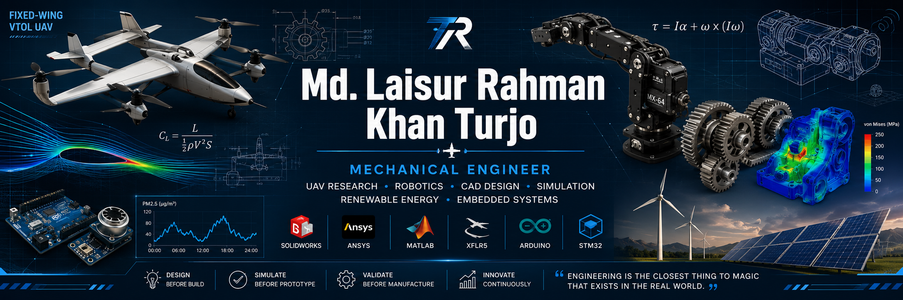
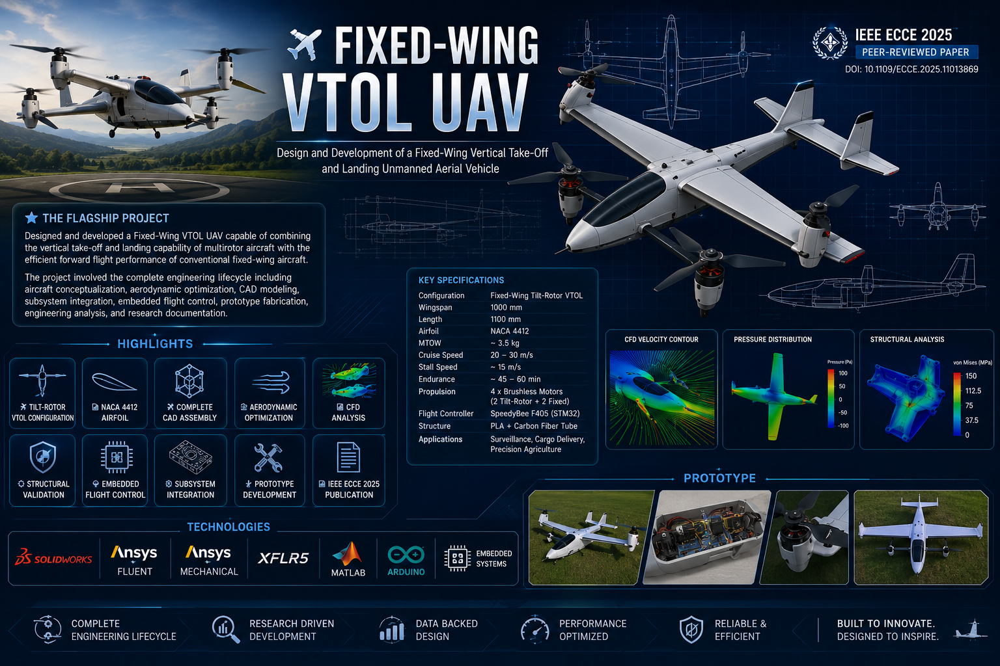

<!-- ========================================================= -->
<!--                                                           -->
<!--         Md Laisur Rahman Khan Turjo GitHub Profile        -->
<!--                                                           -->
<!-- ========================================================= -->

<p align="center">
  
</p>

<h1 align="center">

Md Laisur Rahman Khan Turjo

</h1>

<h3 align="center">

Mechanical Engineer • Robotics & UAV Systems • CAD & Simulation • Embedded Systems

</h3>

<p align="center">

<a href="https://github.com/mdlaisurrahmankhanturjo">


</a>


<a href="https://www.linkedin.com/in/md-laisur-rahman-khan-turjo">


</a>

<a href="mailto:turjokhan2002@gmail.com">


</a>

<a href="https://www.researchgate.net/profile/Laisur-Turjo">


</a>

</p>

---

<p align="center">


</p>

---

# 👋 Welcome

Hello! I'm **Md Laisur Rahman Khan Turjo**, a Mechanical Engineering graduate from **Ahsanullah University of Science and Technology (AUST)** with a strong passion for transforming engineering concepts into practical, manufacturable, and intelligent systems.

My work focuses on the intersection of **mechanical engineering, robotics, unmanned aerial vehicles (UAVs), embedded systems, and product development**. I enjoy taking projects from concept to completion—covering engineering analysis, CAD modeling, simulation, prototyping, embedded programming, testing, and technical documentation.

During my undergraduate studies, I developed multidisciplinary engineering projects ranging from **Fixed-Wing VTOL UAVs** and robotic actuators to renewable energy systems and embedded IoT applications. These experiences strengthened my ability to integrate mechanical design with intelligent control systems while emphasizing practical implementation and engineering best practices.

Beyond technical development, I enjoy collaborative problem-solving, continuous learning, and creating engineering solutions that balance **performance, reliability, manufacturability, and sustainability**.

---

# 🚀 Engineering Domains

<table>

<tr>

<td width="50%">

### Aerospace Engineering

- Fixed-Wing VTOL UAV
- Flight Control
- Aerodynamics
- Airfoil Analysis
- CFD

</td>

<td width="50%">

### Robotics & Mechatronics

- Robot Mechanisms
- Servo Systems
- Embedded Control
- Mechanical Integration
- Product Development

</td>

</tr>

<tr>

<td>

### Mechanical Design

- CAD Modeling
- Mechanical Assemblies
- Machine Design
- FEA
- Design Optimization

</td>

<td>

### Embedded Systems

- Arduino
- STM32
- ESP8266
- Sensors
- Control Systems

</td>

</tr>

</table>

---

# 🎯 Engineering Philosophy

> *"Great engineering is not only about making systems work—it's about designing solutions that are reliable, efficient, manufacturable, maintainable, and capable of solving real-world problems."*

I believe successful engineering combines analytical thinking with practical implementation. Every project should strive to balance innovation with simplicity, ensuring that ideas can be effectively transformed into functional products.

---

# 🌱 Current Focus

- ✈️ Fixed-Wing VTOL UAV Development
- 🤖 Robotics & Intelligent Mechanisms
- ⚙️ Mechanical Product Design
- 📐 Advanced CAD & Simulation
- 🔬 Engineering Research
- 💻 Embedded Systems
- 🚀 Open Source Engineering Projects

---

# 💼 Open To

- Graduate Mechanical Engineering Roles
- Robotics Engineering
- UAV Systems
- Mechanical Design Engineering
- Research & Development
- Mechatronics
- Automation Engineering

---

# 📫 Let's Connect

<p align="center">

<a href="mailto:turjokhan2002@gmail.com">


</a>

<a href="https://www.linkedin.com/in/md-laisur-rahman-khan-turjo">


</a>

<a href="https://www.researchgate.net/profile/Laisur-Turjo">


</a>

</p>

---

> **"Design • Simulate • Prototype • Validate • Innovate"**
>
> <!-- ========================================================= -->
<!--                  PART 2 - ENGINEERING TOOLBOX             -->
<!-- ========================================================= -->

# 🛠 Engineering Toolbox

My engineering approach combines **mechanical design**, **simulation**, **embedded systems**, and **prototype development** to transform ideas into practical engineering solutions. I enjoy working across multiple disciplines, integrating design, analysis, manufacturing, electronics, and programming throughout the product development lifecycle.

---

# ⚙️ Core Engineering Expertise

<table>

<tr>

<td width="33%">

### ✈️ Aerospace

- Fixed-Wing VTOL UAV
- Flight Control Systems
- Aircraft Configuration
- Airfoil Analysis
- Aerodynamic Optimization

</td>

<td width="33%">

### 🤖 Robotics

- Mechanism Design
- Mechatronics
- Robot Actuators
- Servo Integration
- Motion Systems

</td>

<td width="33%">

### ⚙️ Mechanical Design

- Product Design
- Machine Design
- CAD Assembly
- Engineering Drawings
- Design Optimization

</td>

</tr>

</table>

---

# 💻 Software & Engineering Tools

<p align="center">


</p>

<p align="center">


</p>

---

# 📐 Mechanical Design

### CAD Development

- Parametric Part Design
- Assembly Modeling
- Sheet Metal Basics
- Motion Studies
- Technical Drawings
- Design for Manufacturing (DFM)
- Design for Assembly (DFA)
- Bill of Materials (BOM)

### Product Development

- Concept Generation
- Design Optimization
- Prototype Development
- Reverse Engineering
- Mechanical Integration

---

# 🌬️ Engineering Simulation

### Computational Analysis

- Static Structural Analysis
- CFD Simulation
- Aerodynamic Analysis
- Airfoil Performance Evaluation
- Lift & Drag Estimation
- Stress Distribution
- Mesh Generation
- Boundary Condition Setup

### Engineering Validation

- Design Verification
- Simulation-Based Optimization
- Engineering Calculations
- Result Interpretation

---

# 🤖 Robotics & Embedded Systems

### Hardware Platforms

- Arduino UNO
- STM32
- ESP8266
- Dynamixel MX-64
- Electronic Sensors
- Servo Motors
- ESC Integration

### Embedded Development

- Sensor Integration
- PWM Control
- Serial Communication
- Embedded Programming
- Data Acquisition
- Control Logic
- Hardware Debugging

---

# 💻 Programming

Languages

- Python
- C++
- Arduino (Embedded C)

Applications

- Engineering Automation
- Numerical Computation
- Sensor Programming
- Data Processing
- Embedded Control
- Algorithm Development

---

# 🔋 Renewable Energy

Using HOMER Pro

Experience includes

- Solar PV Design
- Wind Energy Analysis
- Hybrid Power Systems
- Energy Yield Assessment
- Techno-Economic Analysis
- Resource Optimization

---

# 🏭 Manufacturing & Prototyping

- 3D Printing
- PLA Prototyping
- Carbon Fiber Reinforcement
- Mechanical Assembly
- Fastener Design
- Tolerance Consideration
- Prototype Testing
- Design Validation

---

# 📊 Engineering Data Analysis

- Microsoft Excel
- OriginLab
- MATLAB
- Power BI

Experience

- Experimental Analysis
- Engineering Graphs
- Data Visualization
- Sensor Data Logging
- Statistical Evaluation
- Performance Comparison

---

# 🔬 Engineering Workflow

```text
Problem Definition
        │
        ▼
Concept Development
        │
        ▼
CAD Design
        │
        ▼
Engineering Analysis
        │
        ▼
Optimization
        │
        ▼
Prototype Development
        │
        ▼
Testing & Validation
        │
        ▼
Documentation
```

---

# 📈 Technical Proficiency

| Engineering Area | Level |
|------------------------------|--------------|
| Mechanical Design | ██████████ Expert |
| CAD (SolidWorks) | ██████████ Expert |
| Product Development | █████████▉ Advanced |
| ANSYS Mechanical | █████████ Advanced |
| ANSYS Fluent | ████████▉ Advanced |
| Aerodynamics | ████████▉ Advanced |
| XFLR5 | ████████▉ Advanced |
| MATLAB | ████████ Intermediate |
| Arduino | ████████ Intermediate |
| Embedded Systems | ███████ Intermediate |
| Python | ███████ Intermediate |
| C++ | ██████ Working Knowledge |
| Renewable Energy | ████████ Intermediate |
| Technical Documentation | █████████ Advanced |
| Engineering Research | █████████ Advanced |

---

# 🎯 Engineering Strengths

✅ Mechanical Product Design

✅ UAV Development

✅ Robotics & Mechatronics

✅ CAD & Engineering Drawings

✅ CFD & FEA

✅ Engineering Simulation

✅ Embedded Systems

✅ Product Development

✅ Research & Technical Writing

✅ Rapid Prototyping

✅ Design Optimization

✅ Multidisciplinary Engineering

---

> **"Engineering excellence comes from combining sound theory with practical implementation."**
>
> <!-- ========================================================= -->
<!--     PART 3 - ACHIEVEMENTS • RESEARCH • EDUCATION          -->
<!-- ========================================================= -->

# 🏆 Achievements

Throughout my undergraduate journey, I focused on applying engineering principles to solve practical design challenges through multidisciplinary projects. My work spans **UAV systems, robotics, renewable energy, embedded systems, and mechanical product design**, integrating engineering analysis with hands-on implementation.

## 🌟 Highlights

- ✈️ Designed and developed a **Fixed-Wing VTOL UAV** integrating aerodynamic analysis, CAD modeling, embedded control systems, prototype fabrication, and flight transition concepts.
- 📄 Published an engineering research paper at the **2025 International Conference on Electrical, Computer and Communication Engineering (IEEE ECCE 2025)**.
- 🤖 Designed a **Hybrid Dual-Rotation Actuator** using dual Dynamixel MX-64 servos for compact robotic applications.
- ⚙️ Developed a **Stress-Optimized Compound Gearbox** using SolidWorks and Finite Element Analysis.
- 🌞 Designed a **Hybrid Solar–Wind Power Generation System** using HOMER Pro for renewable energy optimization.
- 🌫️ Built a **Low-Cost Smart Air Quality Monitoring System** using Arduino for real-time particulate matter monitoring.
- 📊 Applied engineering simulations using **ANSYS Mechanical, ANSYS Fluent, XFLR5, and MATLAB** across multiple projects.
- 📚 Created complete engineering documentation including CAD models, simulation reports, technical drawings, and research papers.

---

# 📚 Research Publication

## Control System Design of a Fixed-Wing VTOL UAV

> **2025 International Conference on Electrical, Computer and Communication Engineering (ECCE 2025)**

This research presents the design and implementation of the control architecture for a **Fixed-Wing Vertical Take-Off and Landing (VTOL) Unmanned Aerial Vehicle**, focusing on achieving smooth transition between hover and forward flight while maintaining stability and efficiency.

### Research Contributions

- Flight control system development
- VTOL transition strategy
- Mechanical system integration
- Aerodynamic optimization
- Prototype validation
- Engineering documentation

### Research Areas

- Unmanned Aerial Vehicles (UAV)
- Flight Control Systems
- Aerodynamics
- Mechatronics
- Embedded Systems
- Mechanical Design

> 📄 **Paper:** *Control System Design of a Fixed-Wing VTOL UAV*

> 🔗 **IEEE Xplore:** *(Add your IEEE Xplore link here)*

> 🆔 **DOI:** *(Add DOI here)*

> 📑 **BibTeX Citation:** *(Optional)*

---

# 🚀 Engineering Portfolio

The repositories in this GitHub profile document the complete engineering workflow behind each project, including:

- Engineering objectives
- Literature review
- Design methodology
- CAD development
- Engineering calculations
- Simulation and analysis
- Prototype fabrication
- Testing and validation
- Results and discussion
- Lessons learned
- Future improvements

The goal is to demonstrate not only the final outcome but also the engineering process behind each solution.

---

# 🎓 Education

## Bachelor of Science (B.Sc.) in Mechanical Engineering

**Ahsanullah University of Science and Technology (AUST)**  
📍 Dhaka, Bangladesh

**Duration:** 2021 – 2025

### Relevant Academic Areas

- Machine Design
- Fluid Mechanics
- Thermodynamics
- Heat Transfer
- Manufacturing Processes
- Engineering Mechanics
- Control Systems
- Mechatronics
- Robotics
- CAD/CAM
- Renewable Energy Engineering

---

## Higher Secondary Certificate (HSC)

**Science**

Dr. Mahbubur Rahman Mollah College  
📍 Dhaka, Bangladesh

**GPA:** 5.00 / 5.00

---

## Secondary School Certificate (SSC)

**Science**

Bright School & College  
📍 Dhaka, Bangladesh

**GPA:** 5.00 / 5.00

---

# 📜 Professional Development

I continuously improve my technical and professional skills through self-learning, engineering projects, online courses, and research.

Areas of continuous learning include:

- Robotics
- UAV Systems
- Embedded Systems
- ROS 2
- PX4 & ArduPilot
- Python for Engineering
- Advanced CAD Design
- Engineering Simulation
- Product Development

---

# 🏅 Leadership & Activities

### Founder & Shareholder

Leading strategic planning and business development while gaining practical experience in entrepreneurship, operations, and organizational management.

### Administrative & Operations Executive

Developed experience in administrative coordination, inventory management, CRM, procurement, and operational workflow optimization.

### Engineering Community

Actively interested in engineering research, technical documentation, multidisciplinary collaboration, and continuous professional development.

---

# 🌍 Research Interests

My long-term research interests include:

- Fixed-Wing VTOL UAVs
- Autonomous Flight Systems
- Robotics & Mechatronics
- Mechanical Product Design
- Design Optimization
- Embedded Intelligence
- Aerospace Engineering
- Renewable Energy Systems
- Intelligent Manufacturing
- Human-Centered Engineering Design

---

# 💼 Career Objective

I aspire to contribute to multidisciplinary engineering teams developing innovative products in the fields of **mechanical engineering, robotics, UAV systems, aerospace, embedded technologies, and intelligent automation**.

My goal is to combine engineering analysis, practical design, simulation, prototyping, and research to develop reliable, manufacturable, and impactful engineering solutions while continuously learning and growing as an engineer.

---

# 🌟 Core Values

- Engineering Excellence
- Integrity
- Curiosity
- Lifelong Learning
- Innovation
- Collaboration
- Technical Precision
- Sustainability
- Continuous Improvement

---

> *"Every project is an opportunity to learn, innovate, and create engineering solutions that make a meaningful impact."*
>
> <!-- ========================================================= -->
<!--                PART 4 • FEATURED PROJECTS                 -->
<!-- ========================================================= -->

# 🚀 Featured Engineering Projects

Engineering is about transforming ideas into practical solutions through systematic design, analysis, validation, and continuous improvement. My projects combine **mechanical engineering, robotics, aerospace, renewable energy, embedded systems, and engineering research**, with an emphasis on multidisciplinary problem-solving and technical documentation.

Each repository documents the engineering process—from concept development and CAD design to simulation, prototype development, testing, and final results.

---

## ✈️ Fixed-Wing VTOL UAV
### *Design and Development of a Fixed-Wing Vertical Take-Off and Landing Unmanned Aerial Vehicle*

<p align="center">

<a href="https://github.com/mdlaisurrahmankhanturjo/fixed-wing-vtol-uav">

<p align="center">
  
</p>
</a>

</p>

The flagship project of my engineering portfolio.

Designed and developed a **Fixed-Wing VTOL UAV** capable of combining the vertical take-off and landing capability of multirotor aircraft with the efficient forward flight performance of conventional fixed-wing aircraft.

The project involved the complete engineering lifecycle including aircraft conceptualization, aerodynamic optimization, CAD modeling, subsystem integration, embedded flight control, prototype fabrication, engineering analysis, and research documentation.

### Highlights

- ✈️ Tilt-Rotor VTOL Configuration
- 📐 NACA 4412 Airfoil
- 🛠 Complete CAD Assembly
- 🌬 Aerodynamic Optimization
- 📊 CFD Analysis
- ⚙ Structural Validation
- 🔌 Embedded Flight Control
- 🧪 Prototype Development
- 📄 IEEE ECCE 2025 Publication

**Technologies**

`SolidWorks`
`ANSYS Fluent`
`ANSYS Mechanical`
`XFLR5`
`MATLAB`
`Arduino`
`Embedded Systems`

<p align="center">

<a href="https://github.com/mdlaisurrahmankhanturjo/fixed-wing-vtol-uav">


</a>

</p>

---

## 🤖 Hybrid Dual-Rotation Actuator
### *Compact Robotic Actuator using Dual Dynamixel MX-64 Servos*

<p align="center">

<a href="https://github.com/mdlaisurrahmankhanturjo/hybrid-dual-rotation-actuator">


</a>

</p>

Designed a lightweight robotic actuator integrating two Dynamixel MX-64 servo motors within a four-bearing support mechanism for precise and stable dual-axis rotation.

The project focuses on compact mechanical architecture, CAD optimization, manufacturability, and robotic mechanism development.

### Highlights

- Dual-Axis Motion
- Four-Bearing Design
- Compact Mechanical Layout
- CAD Optimization
- Modular Design
- 3D Printable Components

**Technologies**

`SolidWorks`
`Mechanical Design`
`Robotics`
`Mechatronics`

<p align="center">

<a href="https://github.com/mdlaisurrahmankhanturjo/hybrid-dual-rotation-actuator">


</a>

</p>

---

## ⚙️ Stress-Optimized Compound Gearbox
### *Mechanical Power Transmission Design*

<p align="center">

<a href="https://github.com/mdlaisurrahmankhanturjo/stress-optimized-compound-gearbox">


</a>

</p>

Designed a four-stage compound gearbox optimized for efficient torque transmission while minimizing stress concentration through CAD modeling and finite element analysis.

### Highlights

- Gear Train Design
- Static Structural Analysis
- CAD Assembly
- Mechanical Optimization
- Engineering Drawings

**Technologies**

`SolidWorks`
`ANSYS Mechanical`
`Machine Design`

<p align="center">

<a href="https://github.com/mdlaisurrahmankhanturjo/stress-optimized-compound-gearbox">


</a>

</p>

---

## 🌞 Hybrid Solar–Wind Power Plant
### *Renewable Energy System Design*

<p align="center">

<a href="https://github.com/mdlaisurrahmankhanturjo/hybrid-solar-wind-power-plant">


</a>

</p>

Designed a hybrid renewable energy system integrating photovoltaic solar panels and wind turbines using HOMER Pro to optimize energy production, reliability, and cost efficiency.

### Highlights

- HOMER Simulation
- Solar PV Design
- Wind Energy Assessment
- Cost Optimization
- Renewable Energy Planning

**Technologies**

`HOMER Pro`
`Renewable Energy`
`Energy Analysis`

<p align="center">

<a href="https://github.com/mdlaisurrahmankhanturjo/hybrid-solar-wind-power-plant">


</a>

</p>

---

## 🌫️ Smart Air Quality Monitoring System
### *Arduino-Based Environmental Monitoring Platform*

<p align="center">

<a href="https://github.com/mdlaisurrahmankhanturjo/smart-air-quality-monitoring-system">


</a>

</p>

Developed an Arduino-based embedded system capable of monitoring particulate matter concentration in real time using a low-cost optical dust sensor with data acquisition and visualization.

### Highlights

- Real-Time PM Monitoring
- Embedded Programming
- Sensor Integration
- Data Logging
- Experimental Validation

**Technologies**

`Arduino`
`Embedded Systems`
`Sensors`
`MATLAB`

<p align="center">

<a href="https://github.com/mdlaisurrahmankhanturjo/smart-air-quality-monitoring-system">


</a>

</p>

---

# 📊 Engineering Capabilities Demonstrated

<p align="center">

| Aerospace | Robotics | Mechanical Design | Simulation |
|:---------:|:--------:|:-----------------:|:----------:|
| ✈️ | 🤖 | ⚙️ | 📊 |

| Embedded Systems | Renewable Energy | Product Development | Research |
|:----------------:|:----------------:|:-------------------:|:--------:|
| 💻 | 🌞 | 🛠 | 📄 |

</p>

---

> **"Every repository represents a complete engineering workflow—from identifying a problem and developing a concept to validating the design through simulation, prototyping, testing, and technical documentation."**

<!-- ========================================================= -->
<!--          PART 5 • PROFESSIONAL EXPERIENCE                 -->
<!-- ========================================================= -->

# 💼 Professional Experience

While my primary focus is engineering, I have also gained valuable experience in operations, business administration, customer engagement, and leadership. These roles have strengthened my communication, organizational, and project management skills, complementing my technical background and preparing me for multidisciplinary engineering environments.

---

## 🏢 Administrative & Operations Executive

> **Current Position**

Responsible for supporting day-to-day business operations while improving organizational efficiency through effective coordination, documentation, inventory management, procurement, and customer relationship management.

### Responsibilities

- Coordinate operational workflows
- Inventory and asset management
- Procurement and vendor communication
- Documentation and reporting
- Customer relationship management (CRM)
- Administrative process improvement
- Team coordination
- Operational planning

### Skills Developed

`Operations Management`
`Documentation`
`Inventory Control`
`Vendor Management`
`CRM`
`Problem Solving`
`Communication`

---

## 🚀 Founder & Shareholder

As a founder, I actively participate in business strategy, planning, operational decision-making, and long-term organizational development while balancing technical and managerial responsibilities.

### Responsibilities

- Strategic planning
- Business development
- Decision making
- Team leadership
- Project coordination
- Operational oversight
- Process improvement

### Skills Developed

`Leadership`
`Entrepreneurship`
`Strategic Planning`
`Business Operations`
`Project Management`

---

## 📞 Telesales Executive

Worked in customer communication and relationship management, developing strong interpersonal skills while learning how to understand customer requirements and communicate technical information clearly.

### Responsibilities

- Customer communication
- Lead generation
- Client support
- CRM management
- Product communication
- Sales reporting

### Skills Developed

`Customer Communication`
`Negotiation`
`CRM`
`Presentation`
`Relationship Building`

---

# 👨‍💼 Leadership Experience

Throughout my academic and professional journey, I have enjoyed taking initiative, coordinating teams, and contributing to collaborative engineering environments.

### Leadership Strengths

- Team Collaboration
- Technical Communication
- Cross-functional Coordination
- Project Planning
- Documentation
- Problem Solving
- Continuous Learning
- Time Management

---

# 🌍 Professional Interests

I am particularly interested in contributing to engineering teams working in:

✈️ Aerospace Engineering

🤖 Robotics & Automation

⚙️ Mechanical Product Development

📐 CAD & Engineering Simulation

🛰️ UAV Systems

🏭 Manufacturing & Production

🔬 Research & Development

🌱 Renewable Energy

💻 Embedded Systems

---

# 🎯 Career Vision

My long-term goal is to contribute to innovative engineering projects that combine **mechanical design, intelligent control systems, robotics, and advanced simulation** to develop practical, reliable, and impactful technologies.

I aspire to work in multidisciplinary environments where I can continue learning while contributing to the complete engineering lifecycle—from concept development and analysis to prototyping, validation, and product realization.

---

# 🤝 Beyond Engineering

Outside of technical work, I enjoy:

- 📚 Reading about emerging technologies
- ✈️ Exploring aerospace innovations
- 🤖 Learning robotics and automation
- 💡 Developing engineering concepts
- 🌍 Continuous professional development
- 🧠 Learning new software and tools
- 📖 Technical writing and research
- 🤝 Collaborative teamwork

---

# 📈 What I Bring to a Team

✅ Strong Mechanical Engineering Foundation

✅ Hands-on Design Experience

✅ Engineering Simulation Skills

✅ Research & Technical Documentation

✅ Product Development Mindset

✅ Rapid Learning Ability

✅ Multidisciplinary Collaboration

✅ Professional Communication

✅ Leadership & Initiative

✅ Continuous Improvement Mindset

---

> *"Engineering is a continuous journey of learning, designing, testing, improving, and delivering solutions that create meaningful impact."*
>
> <!-- ========================================================= -->
<!--               PART 6 • GITHUB DASHBOARD                  -->
<!-- ========================================================= -->

# 📊 GitHub Dashboard

My GitHub serves as an engineering portfolio where I document projects, research, CAD designs, simulation results, embedded systems development, and technical documentation. Every repository reflects a commitment to structured engineering workflows and continuous learning.

---

## 📈 GitHub Statistics

<p align="center">


</p>

---

## 💻 Most Used Languages

<p align="center">


</p>

---

## 📅 Contribution Graph

<p align="center">


</p>

---

## 🏆 GitHub Achievements

<p align="center">


</p>

---

## ⚡ Development Activity

<p align="center">


</p>

> **Note:** The WakaTime card requires a WakaTime account and GitHub integration. If you don't use WakaTime, simply remove this section.

---

## 📦 Repository Overview

| Repository | Domain |
|------------|--------|
| ✈️ Fixed-Wing VTOL UAV | Aerospace Engineering |
| 🤖 Hybrid Dual-Rotation Actuator | Robotics & Mechatronics |
| ⚙️ Stress-Optimized Compound Gearbox | Mechanical Design |
| 🌞 Hybrid Solar–Wind Power Plant | Renewable Energy |
| 🌫️ Smart Air Quality Monitoring | Embedded Systems & IoT |

---

## 🎯 Engineering Focus

<p align="center">

```text
Mechanical Engineering      ████████████████████ 100%

CAD Design                  ██████████████████░ 95%

Engineering Simulation      █████████████████░░ 90%

Product Development         █████████████████░░ 90%

Robotics                    ████████████████░░░ 85%

Embedded Systems            ███████████████░░░░ 80%

Research                    ███████████████░░░░ 80%

Renewable Energy            ██████████████░░░░░ 75%

Programming                 ████████████░░░░░░░ 65%
```

</p>

---

## 📈 Engineering Workflow

```text
Idea
 │
 ▼
Research
 │
 ▼
Concept Design
 │
 ▼
CAD Modeling
 │
 ▼
Simulation
 │
 ▼
Optimization
 │
 ▼
Prototype
 │
 ▼
Testing
 │
 ▼
Documentation
 │
 ▼
Continuous Improvement
```

---

## 🌟 Portfolio Highlights

- ✈️ Fixed-Wing VTOL UAV Design & Development
- 📄 IEEE ECCE 2025 Publication
- 🤖 Robotics & Mechatronics Projects
- ⚙️ Mechanical Product Design
- 🌬️ Aerodynamic & Structural Simulation
- 🌞 Renewable Energy System Design
- 🌫️ Embedded Systems & IoT
- 📚 Engineering Research & Technical Documentation

---

## 📌 Current Goals

- 🚀 Expand my engineering portfolio with detailed project documentation.
- 🤖 Explore advanced robotics and autonomous systems.
- ✈️ Continue research in UAV design and flight control.
- 🧠 Strengthen embedded systems and automation skills.
- 🌍 Contribute to impactful open-source engineering projects.

---

> *"Engineering is not measured by the number of projects completed, but by the quality, impact, and knowledge gained from every challenge."*

<!-- ========================================================= -->
<!--            PART 7 • CERTIFICATIONS & CONTACT             -->
<!-- ========================================================= -->

# 📜 Certifications & Professional Development

I believe that learning extends far beyond the classroom. Alongside my academic studies and engineering projects, I continuously develop my skills through online courses, technical research, and practical implementation.

## Engineering & Technical Skills

- ✅ SolidWorks CAD Design
- ✅ ANSYS Mechanical & Fluent
- ✅ MATLAB & Simulink
- ✅ Arduino Programming
- ✅ XFLR5 Aerodynamic Analysis
- ✅ HOMER Pro Renewable Energy Simulation
- ✅ Engineering Research & Technical Writing

---

## Continuous Learning

Currently expanding my knowledge in:

- 🤖 Robotics & Intelligent Systems
- ✈️ UAV Design & Flight Control
- 🛰️ PX4 & ArduPilot Ecosystem
- 🌐 ROS 2 (Robot Operating System)
- 💻 Embedded Systems
- 🧠 Artificial Intelligence for Robotics
- 📊 Data Analysis & Visualization
- ⚙️ Advanced Mechanical Product Design

---

# 📖 Research Interests

My research interests focus on multidisciplinary engineering, where mechanical systems are integrated with intelligent control, simulation, and embedded technologies.

### Primary Areas

- ✈️ Fixed-Wing VTOL UAV
- 🤖 Robotics & Mechatronics
- 🛰️ Autonomous Systems
- ⚙️ Mechanical Product Design
- 📐 Engineering Optimization
- 🌬️ Computational Fluid Dynamics (CFD)
- 🧮 Finite Element Analysis (FEA)
- 🔌 Embedded Systems
- 🌞 Renewable Energy
- 🏭 Smart Manufacturing

---

# 🌍 Open to Collaboration

I'm always interested in collaborating on engineering projects, research initiatives, and open-source development.

### Areas of Interest

- Aerospace Engineering
- Robotics
- Mechanical Engineering
- Product Development
- Engineering Simulation
- Embedded Systems
- Renewable Energy
- CAD Design
- Engineering Research

If you have an exciting idea, research opportunity, or engineering challenge, I'd be happy to connect and explore how we can work together.

---

# 🤝 Let's Connect

<p align="center">

<a href="https://www.linkedin.com/in/md-laisur-rahman-khan-turjo">

</a>

<a href="mailto:turjokhan2002@gmail.com">

</a>

<a href="https://github.com/mdlaisurrahmankhanturjo">

</a>

</p>

---

# 📬 Contact Information

| Platform | Link |
|----------|------|
| 💼 LinkedIn | https://www.linkedin.com/in/md-laisur-rahman-khan-turjo |
| 📧 Email | turjokhan2002@gmail.com |
| 💻 GitHub | https://github.com/mdlaisurrahmankhanturjo |

---

# 💡 Philosophy

> *"Engineering is the art of transforming ideas into reliable, efficient, and meaningful solutions through creativity, analysis, and continuous improvement."*

---

# 🙏 Thank You for Visiting

Thank you for taking the time to explore my GitHub portfolio.

I hope these projects demonstrate not only my technical skills but also my curiosity, dedication, and enthusiasm for solving real-world engineering challenges.

If you find my work interesting or would like to collaborate, feel free to connect with me.

---

<p align="center">

### ⭐ If you enjoy my work, consider giving a star to the repositories that interest you!

</p>

---

<p align="center">


</p>

---

<p align="center">

**Designed & Built with ❤️ by Md. Laisur Rahman Khan Turjo**

Mechanical Engineer • Researcher • UAV Developer • Robotics Enthusiast

© 2026 All Rights Reserved

</p>


<!-- ========================================================= -->
<!--             PART 8 • PORTFOLIO ROADMAP & FOOTER           -->
<!-- ========================================================= -->

# 🚀 What's Next?

Engineering is a continuous journey of learning, experimentation, and innovation. This GitHub portfolio will continue to grow as I explore new technologies, complete challenging projects, and contribute to engineering research and open-source development.

---

# 🛣️ Engineering Roadmap

## 📅 Current Focus

- ✈️ Expanding the Fixed-Wing VTOL UAV platform
- 🤖 Advanced robotic mechanism development
- ⚙️ Mechanical product optimization
- 🛰️ Flight control algorithm improvement
- 🔌 Embedded systems programming
- 📚 Publishing technical documentation

---

## 🔭 Upcoming Projects

- 🚁 Autonomous Fixed-Wing VTOL UAV
- 🤖 Robotic Manipulator with Computer Vision
- 🦿 Intelligent Robotic Gripper
- 🏭 Industrial Automation Projects
- 🌐 IoT-Based Smart Factory Monitoring
- ⚡ Smart Energy Management Systems
- 🛰️ PX4 & ArduPilot Integration
- 🧠 AI-Assisted Engineering Applications
- 🌍 ROS 2 Robotics Projects
- 🚀 Autonomous Navigation Systems

---

# 🌱 Open Source Philosophy

I strongly believe that engineering knowledge should be shared.

This portfolio is built not only to showcase my work but also to help students, researchers, and fellow engineers understand the complete engineering design process.

Whenever possible, my repositories include:

- 📖 Detailed documentation
- 📐 Engineering calculations
- 🖥️ CAD models
- 📊 Simulation results
- 📄 Research reports
- 📷 Prototype images
- 💻 Source code
- 📑 Technical references

I hope these resources inspire others and contribute to collaborative engineering learning.

---

# 🎯 My Engineering Principles

✔️ Design Before Build

✔️ Validate Before Manufacture

✔️ Simulate Before Prototype

✔️ Learn From Every Failure

✔️ Document Every Process

✔️ Never Stop Improving

---

# 🌍 Let's Build Something Amazing

Whether you're:

- 👨‍💻 A software developer
- ⚙️ A mechanical engineer
- 🤖 A roboticist
- 🚀 An aerospace enthusiast
- 🔬 A researcher
- 🎓 A student
- 🏭 An industry professional

I'm always happy to connect, exchange ideas, and collaborate on meaningful engineering projects.

---

# 📈 Portfolio Statistics

```text
Engineering Disciplines
├── Aerospace Engineering
├── Mechanical Engineering
├── Robotics
├── Mechatronics
├── Embedded Systems
├── Renewable Energy
├── Engineering Simulation
└── Product Design

Software & Tools
├── SolidWorks
├── ANSYS Mechanical
├── ANSYS Fluent
├── MATLAB
├── XFLR5
├── HOMER Pro
├── Arduino IDE
├── Git & GitHub
└── Microsoft Office

Project Categories
├── UAV Systems
├── Robotics
├── Mechanical Design
├── Renewable Energy
├── Embedded Systems
└── Engineering Research
```

---

# 📊 Repository Status

| Repository | Status |
|------------|--------|
| ✈️ Fixed-Wing VTOL UAV | 🟢 Active |
| 🤖 Hybrid Dual-Rotation Actuator | 🟢 Active |
| ⚙️ Stress-Optimized Compound Gearbox | 🟢 Active |
| 🌞 Hybrid Solar–Wind Power Plant | 🟢 Active |
| 🌫️ Smart Air Quality Monitoring System | 🟢 Active |

---

# 💬 Favorite Engineering Quote

> *"Engineering is the closest thing to magic that exists in the real world."*

---

# ❤️ Support My Work

If you enjoy my projects or find them useful:

⭐ Star the repositories

🍴 Fork the projects

💬 Share feedback

🤝 Collaborate on future work

📢 Share them with other engineers and students

Every contribution, suggestion, and discussion is appreciated.

---

# 🙏 Thank You

Thank you for visiting my GitHub portfolio.

I hope my projects demonstrate not only my engineering knowledge but also my passion for innovation, problem-solving, and continuous learning.

Let's create the future through engineering.

---

<p align="center">


</p>

<p align="center">

### ⭐ Thanks for Visiting!

**Md. Laisur Rahman Khan Turjo**

Mechanical Engineer • UAV Researcher • Robotics Enthusiast • Product Designer

📍 Dhaka, Bangladesh

📧 **turjokhan2002@gmail.com**

💼 **LinkedIn:** https://www.linkedin.com/in/md-laisur-rahman-khan-turjo

🐙 **GitHub:** https://github.com/mdlaisurrahmankhanturjo

---

**"Design. Simulate. Build. Validate. Improve. Repeat."**

</p>
